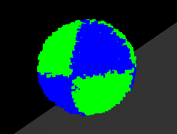

# MPM Viewer

## Usage

``` rust
use mpm_viewer::*;

fn main() {
  let mut world = WorldBuilder::new(world_size, grid_h)
    .with_system(WindowSystem::new())
    .build();

  while world.not_ending() {
    world.step();
  }
}
```

## Base API

When including `mpm_viewer::*`, you can have access to two new functions in
`world`:

- `not_ending() -> bool`: Check if the world is *not* ending
- `is_ending() -> bool`: Check if the world *is* ending

The world will become "ending" when the user close the window or quit the program.

You can still use `for _ in 0..100 { world.step() }`, but then the program will end
after the first 100 steps.

## Coloring

You can also access coloring APIs, so that when visualizing particles, different ones
can display different colors. This can achieve best effect combining with the `with`
API in the `core` library.

### Coloring

You can color individual particle or a bunch of particles together using the
`ParticleColor` component and `Color` struct:

``` rust
world
  .put_ball(b1.center, b1.radius, b1.mass, b1.num_particles)
  .with(ParticleColor(Color::new(1.0, 0.0, 0.0)));
world
  .put_ball(b2.center, b2.radius, b2.mass, b2.num_particles)
  .with(ParticleColor(Color::new(0.0, 1.0, 0.0)));
```

This code will put two balls with the first colored red and the second colored green.

You can also color particles using the `each` API:

``` rust
world
  .put_ball(center, radius, mass, num_particles)
  .each(|&par, world| {

    // Get the position of the particle
    let pos = world.get::<ParticlePosition>(par).unwrap().get();

    // Check the type of color we want to use on that particle
    let (xp, yp, zp) = (pos.x >= center.x, pos.y >= center.y, pos.z >= center.z);
    let use_1 = (xp && yp && zp) || (xp && !yp && !zp) || (!xp && yp && !zp) || (!xp && !yp && zp);

    // Get that color
    let color = if use_1 {
      Color::new(0.0, 1.0, 0.0) // Green
    } else {
      Color::new(0.0, 0.0, 1.0) // Blue
    };

    // Insert the color component to the particle
    world.insert(par, ParticleColor(color));
  });
```

The above example will output a ball like this:

